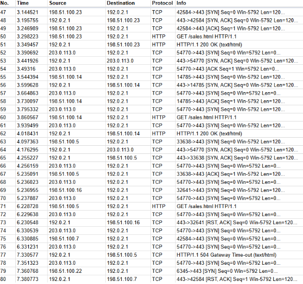
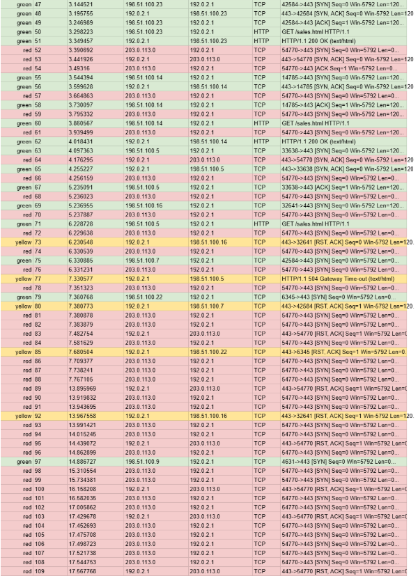

# Network Attacks — SYN Flood Analysis
**Scenario**
You work as a security analyst for a travel agency that advertises sales and promotions on the company’s website. The employees of the company regularly access the company’s sales webpage to search for vacation packages their customers might like. 
One afternoon, you receive an automated alert from your monitoring system indicating a problem with the web server. You attempt to visit the company’s website, but you receive a connection timeout error message in your browser.
You use a packet sniffer to capture data packets in transit to and from the web server. You notice a large number of TCP SYN requests coming from an unfamiliar IP address. The web server appears to be overwhelmed by the volume of incoming traffic and is losing its ability to respond to the abnormally large number of SYN requests. You suspect the server is under attack by a malicious actor.
You take the server offline temporarily so that the machine can recover and return to a normal operating status. You also configure the company’s firewall to block the IP address that was sending the abnormal number of SYN requests. You know that your IP blocking solution won’t last long, as an attacker can spoof other IP addresses to get around this block. You need to alert your manager about this problem quickly and discuss the next steps to stop this attacker and prevent this problem from happening again. You will need to be prepared to tell your boss about the type of attack you discovered and how it was affecting the web server and employees.

---
**Sample of the Wireshark TCP/HTTP log:**

**Sample of the colored log with the IP address of the attacker colored in red:**

---

## Cybersecurity Incident Report

## Section 1: Identify the type of attack that may have caused this network interruption
One potential explanation for the website's connection timeout error message is SYN flood attack, which targets network bandwidth to slow traffic.
The logs show that the attacker with IP address (203.0.113.0) is flooding the server with SYN packet requests.
This event could be: a direct denial of service attack (DOS) called SYN flood attack

## Section 2: Explain how the attack is causing the website to malfunction
When website visitors try to establish a connection with the web server, a three-way handshake occurs using the TCP protocol. Explain the three steps of the handshake:
1. The [SYN] packet is the initial request from an employee visitor trying to connect to a
web page hosted on the web server. SYN stands for “synchronize.”

2.  The [SYN, ACK] packet is the web server’s response to the visitor’s request agreeing to
the connection. SYN, ACK stands for “synchronize acknowledge.”

3.The [ACK] packet is the visitor’s machine acknowledging the permission to connect.
This is the final step required to make a successful TCP connection.

Explain what happens when a malicious actor sends a large number of SYN packets all at once:
The web server is struggling to keep up with the abnormal number of SYN requests coming in at a rapid pace. Then, the web server stops responding to legitimate employee visitor traffic. The visitors receive more error messages indicating that they cannot establish or maintain a connection to the web server.

Explain what the logs indicate and how that affects the server:
Initially, the attacker’s SYN request is answered normally by the web server,but, the logs show that the attacker with IP address (203.0.113.0) is flooding the server with SYN packet requests.Then we observe 2 types of errors in the log, the first one is an HTTP/1.1 504 Gateway Time-out (text/html) error message. This message is generated by a gateway server that was waiting for a response from the web server. The second one is an [RST, ACK] packet, which would be sent to the requesting visitor if the [SYN, ACK] packet is not received by the web server.Finally, the web server stops responding to legitimate employee visitor traffic. The visitors receive more error messages indicating that they cannot establish or maintain a connection to the web server. From log item number 125 on, the web server stops responding.

## Suggestion
A potential ways to secure the network so this SYN flood attack can be prevented in the future is enabling SYN cookies
What it is: A technique that allows the server to avoid allocating resources until the handshake is complete.

**How it helps**: The server encodes connection info into the SYN-ACK response and only creates a real connection if the client replies correctly.

**Implementation**: Most modern operating systems (Linux, Windows, BSD) support SYN cookies — you just enable them in the network configuration.

 **Example (Linux)**:
sudo sysctl -w net.ipv4.tcp_syncookies=1
