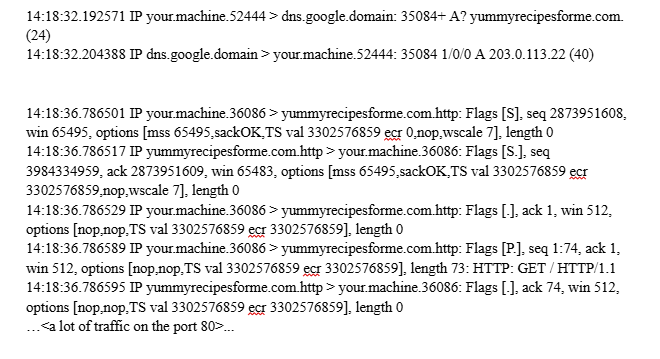

# OS Hardening & Web Malware Investigation

**Scenario**

You are a cybersecurity analyst for yummyrecipesforme.com, a website that sells recipes and cookbooks. A former employee has decided to lure users to a fake website with malware.The former employee/ hacker executed a brute force attack to gain access to the web host. They repeatedly entered several known default passwords for the administrative account until they correctly guessed the right one. After they obtained the login credentials, they were able to access the admin panel and change the website’s source code. They embedded a javascript function in the source code that prompted visitors to download and run a file upon visiting the website. After embedding the malware, the hacker changed the password to the administrative account. When customers download the file, they are redirected to a fake version of the website that contains the malware.Several hours after the attack, multiple customers emailed yummyrecipesforme’s helpdesk. They complained that the company’s website had prompted them to download a file to access free recipes. The customers claimed that, after running the file, the address of the website changed and their personal computers began running more slowly. In response to this incident, the website owner tries to log in to the admin panel but is unable to, so they reach out to the website hosting provider. You and other cybersecurity analysts are tasked with investigating this security event. To address the incident, you create a sandbox environment to observe the suspicious website behavior. You run the network protocol analyzer tcpdump, then type in the URL for the website, yummyrecipesforme.com. As soon as the website loads, you are prompted to download an executable file to update your browser. You accept the download and allow the file to run. You then observe that your browser redirects you to a different URL, greatrecipesforme.com, which contains the malware.  

**SAMPLE OF THE TCPDUMP LOG:**

---

## Security incident report

## Section 1: Identify the network protocol involved in the incident

DNS   -> to get the IP address of the domain
HTTP -> for encrypted web traffic

## Section 2: Document the incident

A former employee executed a brute force attack to gain access to the web host. He embedded a javascript function in the source code that prompted visitors to download and run a file upon visiting the website. After embedding the malware, the hacker changed the password to the administrative account. We can confirm this with the tcpdump showing a DNS resolution of both domain:
yummyrecipesforme.com. -> 203.0.113.22 
greatrecipesforme.com. -> 192.0.2.17 

It forced customers to download malware and some experienced a slow down of their system.
This incident has multiple causes, first a weak password penetrable with brute force, then the tcpdump shows that all traffic is on port 80 (HTTP ) enabling easy injection. 

## Section 3: Recommend one remediation for brute force attacks

Implement Multi-Factor Authentication (MFA) and account lockout policies to prevent brute force attacks.
Monitoring login attempts.
Force HTTPS (redirect HTTP-> HTTPS).

