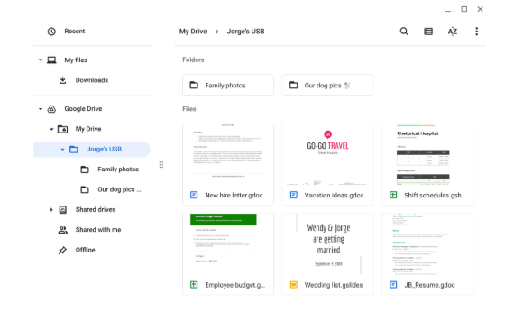

# Removable Media (USB) Risk Analysis

**Scenario:** 
You are part of the security team at Rhetorical Hospital and arrive to work one morning. On the ground of the parking lot, you find a USB stick with the hospital's logo printed on it. There’s no one else around who might have dropped it, so you decide to pick it up out of curiosity.
You bring the USB drive back to your office where the team has virtualization software installed on a workstation. Virtualization software can be used for this very purpose because it’s one of the only ways to safely investigate an unfamiliar USB stick. The  software works by running a simulated instance of the computer on the same workstation. This simulation isn’t connected to other files or networks, so the USB drive can’t affect other systems if it happens to be infected with malicious software.

**USB content**:

---
## Parking lot USB exercise

**Contents**

Several files could contain personally identifiable information (PII)—for example, the New Hire Letter.gdoc or Employee Budget Tracker.xlsx may list names, salaries, or contact details.It is not safe to store personal and work files together. If the USB is lost or infected, both private family photos and confidential hospital or employee data could be exposed.

**Attacker mindset**
An attacker finding this USB could easily gather employee names, job roles, or scheduling data from the shift sheet and use it for phishing or impersonation. The new-hire letter or resume could help create targeted social-engineering attacks by referencing specific departments or HR staff.
The family and wedding photos could also be exploited to build trust or tailor scams against Jorge, his relatives, or other employees at the hospital.

**Risk analysis**
To mitigate such risks, organizations should apply technical controls like USB port restrictions, data encryption, and endpoint malware scanning. Operational controls include employee training on removable-media handling and clear data-classification policies. 

